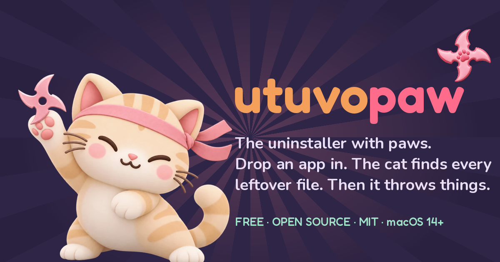

<p align="center"></p>

# UTUVO Paw

**Website: https://mickyyang-1407.github.io/utuvo-paw/** · click the apps, the cat throws things.

The uninstaller with paws. Drop an app in, the cat sniffs out every leftover file
(caches, preferences, support folders, saved state, containers, launch agents…),
then knocks them all off the desk — straight into the Trash. Nothing is deleted permanently.

Free, open source, MIT. macOS 14+.

## Build

```bash
bash scripts/build-app.sh          # → build/UTUVO Paw.app (ad-hoc signed)
open "build/UTUVO Paw.app"
```

```bash
swift test                          # matcher + safety tests
```

## How it decides what belongs to an app

- **Bundle identifier** must appear as a whole token: `com.acme.cliply`, `com.acme.cliply.plist`,
  `group.com.acme.cliply`, `com.acme.cliply.helper` all match; `com.acme.cliplypro` does not.
- **App name / executable name** match only exactly or as `Name.ext` / `Name-…`.
  Plain substring matches are never used, so `Music` does not eat `MusicBrainz`.
- Scanned roots: `~/Library/{Application Support, Caches, Preferences, Preferences/ByHost,
  Saved Application State, Containers, Group Containers, Application Scripts, Logs,
  HTTPStorages, WebKit, Cookies, LaunchAgents, Autosave Information}` and the matching
  `/Library/…` roots. Items under `/Library` are listed but never touched (badge **admin**).
- Everything goes through `FileManager.trashItem`. Paths outside `~/Library`, `/Library`
  or an `.app` bundle are refused by `Trasher.isSafe`.

## Credits

Cat art rendered with GPT from prompts by the author. Fonts: [Fredoka](https://github.com/hafontia/Fredoka-One) and [Nunito](https://github.com/googlefonts/nunito), both SIL OFL 1.1 (see `Sources/UTUVOPaw/Fonts/`). Sounds are synthesised (numpy, no samples) — replace `Sources/UTUVOPaw/Sounds/*.wav` with your own.
Inspired by the wonderful [AppZapper](https://appzapper.com). Different cat.

## Layout

```
Sources/UTUVOPaw/   SwiftUI app (PawApp, ContentView, PawModel, LeftoverScanner, AppInspector)
Sources/UTUVOPaw/Assets/   cat art (PNG)
Resources/          Info.plist, AppIcon.icns
scripts/build-app.sh
Tests/              Matcher, Trasher safety, AppInspector, font registration, real-disk scan→Trash round trip
docs/               the website (GitHub Pages)
scripts/make-fake-app.sh   plants a fake app + leftovers to play with
```
